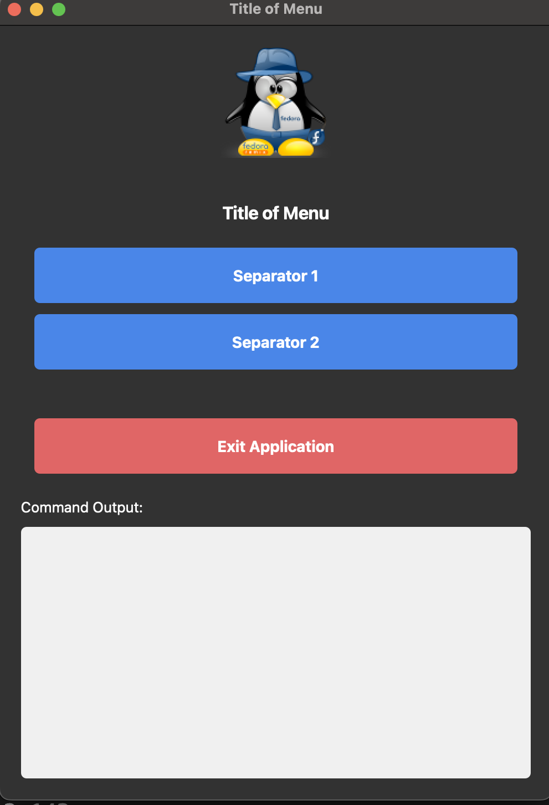
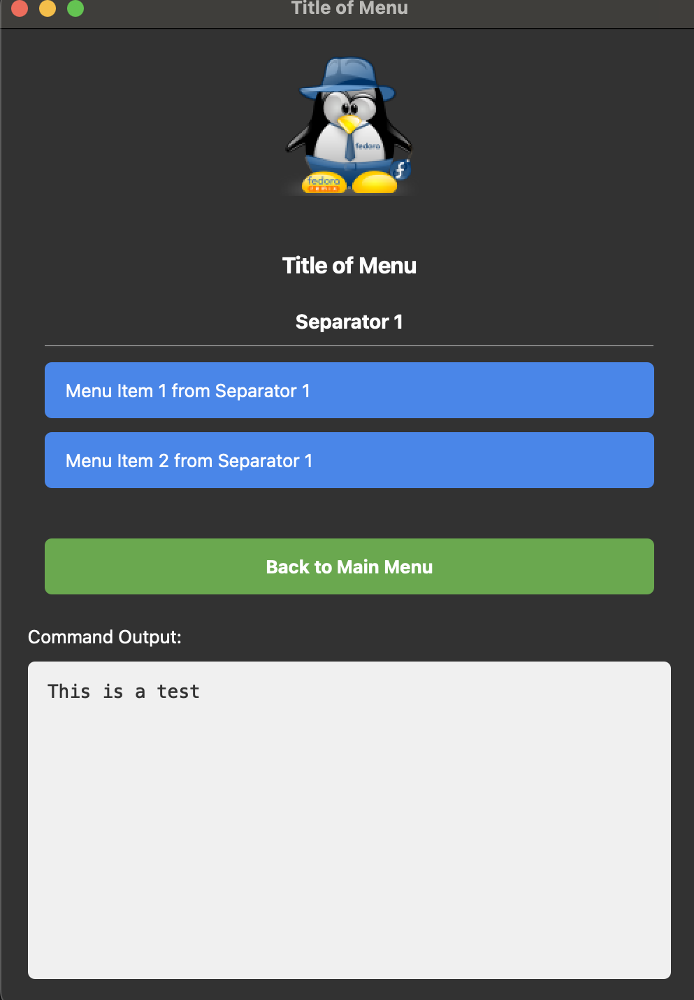

# Python_GUI_Menu

Python Generic GUI Menu Creator. This uses the **config.yml** to create a dynamic application.

````
icon: smallicon.png
logo: logo.png
menu_title: Title of Menu
menu_items:
  - name: Separator 1
    items:
      - name: Menu Item 1 from Separator 1
        command: ls -alF | grep travis
      - name: Menu Item 2 from Separator 1
        command: echo "This is a test"
  - name: Separator 2
    items:
      - name: Menu Item 1 from Separator 2
        command: echo "This is another test"
````






## Development Setup

### Creating the Virtual Environment and Running the Menu

````bash
uv venv menu_venv --python=3.12
source menu_venv/bin/activate
uv pip install PyQt5 PyYaml
python menu.py
````

## Building Standalone Executables

Create self-contained executables that don't require Python or virtual environments on the target system.

### Quick Build (Recommended)

````bash
# Cross-platform Python build script
python build.py

# Or use platform-specific scripts:
./build.sh       # Unix/Linux/macOS
build.bat        # Windows
````

### Build Output

After building, you'll get:
- **Standalone executable**: No Python installation required
- **Distribution package**: Includes executable, config files, and assets
- **ZIP archive**: Ready for distribution

### Build Requirements

The build process automatically installs these dependencies:
- PyInstaller (creates standalone executables)
- PyQt5 (GUI framework)
- PyYAML (configuration parsing)

### For End Users

Once built, users can:
1. Download and extract the distribution package
2. Run the executable directly (no installation needed)
3. Customize the menu by editing `config.yml`

**No Python installation required on the target system!**

## Documentation

- **[BUILD.md](BUILD.md)**: Detailed build instructions and troubleshooting
- **[FONT_FIX.md](FONT_FIX.md)**: Font management system and Qt warning fixes
- **[config.yml](config.yml)**: Current configuration example